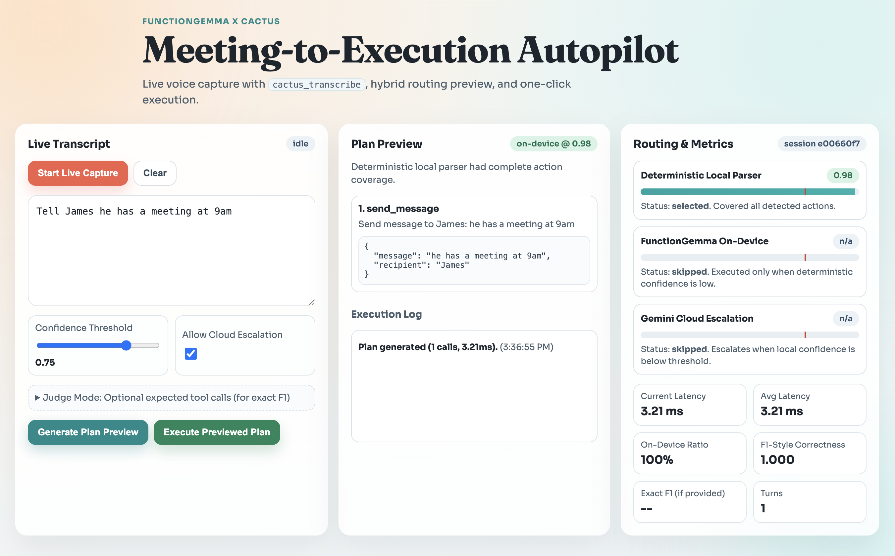

# Meeting Autopilot

A local-first voice-to-action assistant that turns spoken meeting requests into executable function calls with low latency.



## Hackathon Context

This project was built for the **Cactus x Google DeepMind Hackathon**.

It was part of a **multi-city, one-day global hackathon** organized by:
- Google DeepMind
- Cactus Compute
- AI Tinkerers
- AI Nexus

## Results

### Hackathon Leaderboard
- **London:** **#1**
- **Global:** **Top 5**

### Reported leaderboard performance
- **Total score:** `91.3%`
- **F1:** `1.000`
- **Average latency:** `242ms`
- **On-device ratio:** `100%`

### Current local benchmark (this repository)
- **F1:** `1.00`
- **On-device ratio:** `100%`
- **Total score:** `99.5%`

## What This Project Does

Meeting Autopilot has two main parts:

1. **Routing engine (`main.py`)**
   - Parses requests into tool calls
   - Prioritizes deterministic local parsing for speed
   - Falls back to on-device FunctionGemma when needed
   - Uses candidate validation/scoring to choose the best final plan

2. **Web app (`meeting_autopilot_app.py`)**
   - Captures live audio from microphone
   - Transcribes speech using `cactus_transcribe`
   - Shows plan preview before execution
   - Visualizes confidence-based routing stages
   - Displays live metrics (latency, on-device ratio, F1-style correctness)

## Routing Architecture (Short)

The hybrid flow in `generate_hybrid(...)` is:

1. Preprocess and normalize user text
2. Split multi-intent text into action chunks
3. Deterministically extract tool calls/arguments
4. Validate against tool schemas
5. If uncertain/incomplete, run local FunctionGemma inference
6. Score deterministic vs model vs merged candidates
7. Return the best on-device action plan

This design gives strong correctness while keeping latency low and preserving privacy.

For a detailed walkthrough, see:
- [`ROUTING_ARCHITECTURE_GUIDE.md`](ROUTING_ARCHITECTURE_GUIDE.md)

## Tech Stack

- **Python**
- **Cactus Compute** (`cactus_init`, `cactus_complete`, `cactus_reset`, `cactus_transcribe`)
- **Google DeepMind FunctionGemma** (on-device tool calling)
- **Google Gemini (`google-genai`)** (optional cloud escalation path)
- **Flask** (web server + API)
- **Vanilla JS + Web Audio API** (frontend + live audio capture)

## Project Structure

- `main.py` — hybrid routing algorithm and local/cloud orchestration
- `benchmark.py` — objective evaluation harness
- `meeting_autopilot_app.py` — Flask app API and routing endpoints
- `meeting_autopilot/templates/index.html` — frontend page
- `meeting_autopilot/static/app.js` — UI logic + transcription pipeline
- `meeting_autopilot/static/styles.css` — UI styling
- `HACKATHON_INSTRUCTIONS.md` — original challenge instructions

## Setup

### 1) Clone and enter project

```bash
git clone <your-repo-url>
cd meeting-autopilot
```

### 2) Ensure Cactus SDK is available

If you already have Cactus elsewhere, symlink it into this repo:

```bash
ln -s /Users/<you>/functiongemma-hackathon/cactus cactus
```

If you do not have Cactus yet, install from the official repo first.

### 3) Install Python dependencies

```bash
pip install google-genai flask
```

### 4) Download required model weights

From inside your Cactus repo:

```bash
cd cactus
source ./setup
cactus download google/functiongemma-270m-it --reconvert
cactus download openai/whisper-small
cd ..
```

### 5) Optional cloud key

Only needed if you want Gemini fallback:

```bash
export GEMINI_API_KEY="your-key"
```

## Run

### Run benchmark

```bash
python3 benchmark.py
```

### Run web app

```bash
python3 meeting_autopilot_app.py
```

Open:

```text
http://127.0.0.1:8090
```

## Security Notes (Public Repository)

- No hardcoded API keys are required by runtime design.
- `GEMINI_API_KEY` is read from environment variables only.
- Temporary audio files are written to `.context/tmp_audio` and removed after transcription.
- Keep `.context/` and local logs untracked.
- Before publishing, rotate any personal keys used during development.

## License / Attribution

Built as a hackathon project inspired by the Cactus Compute + Google DeepMind FunctionGemma challenge ecosystem.
